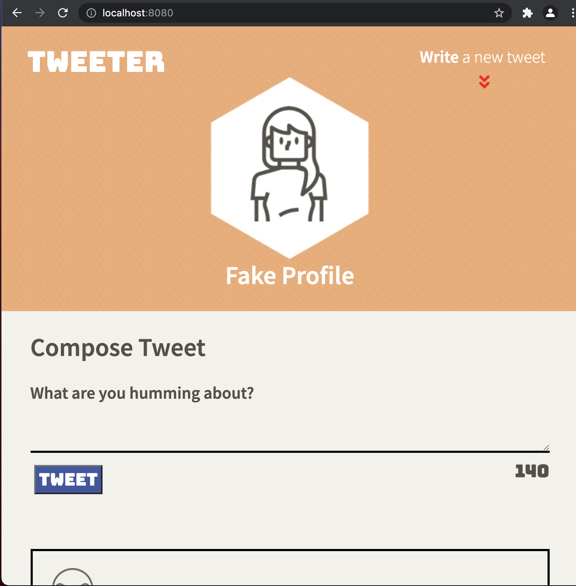
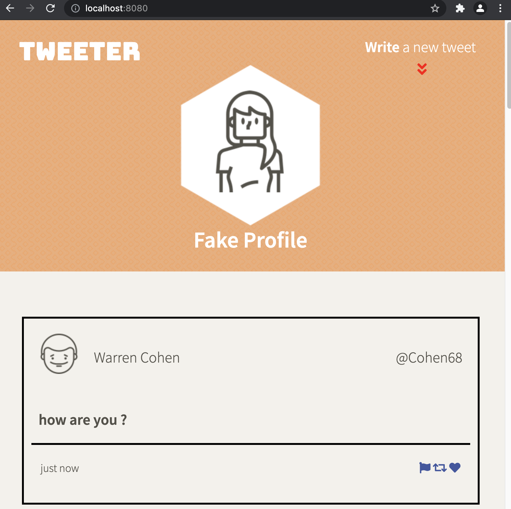
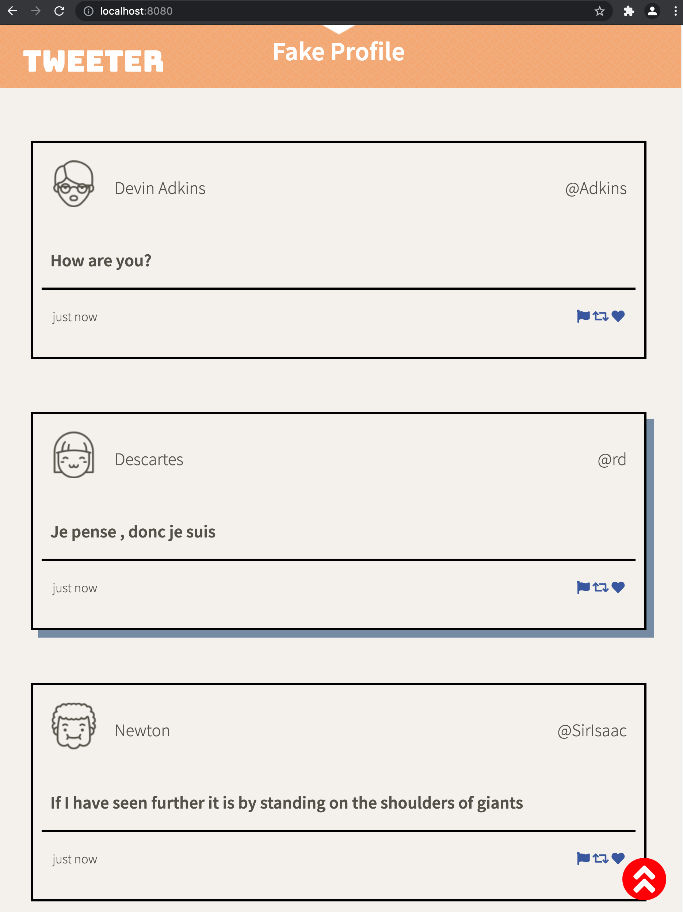
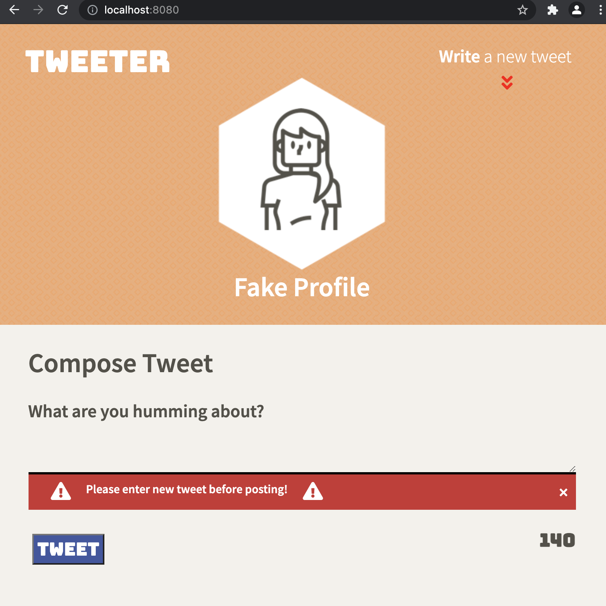
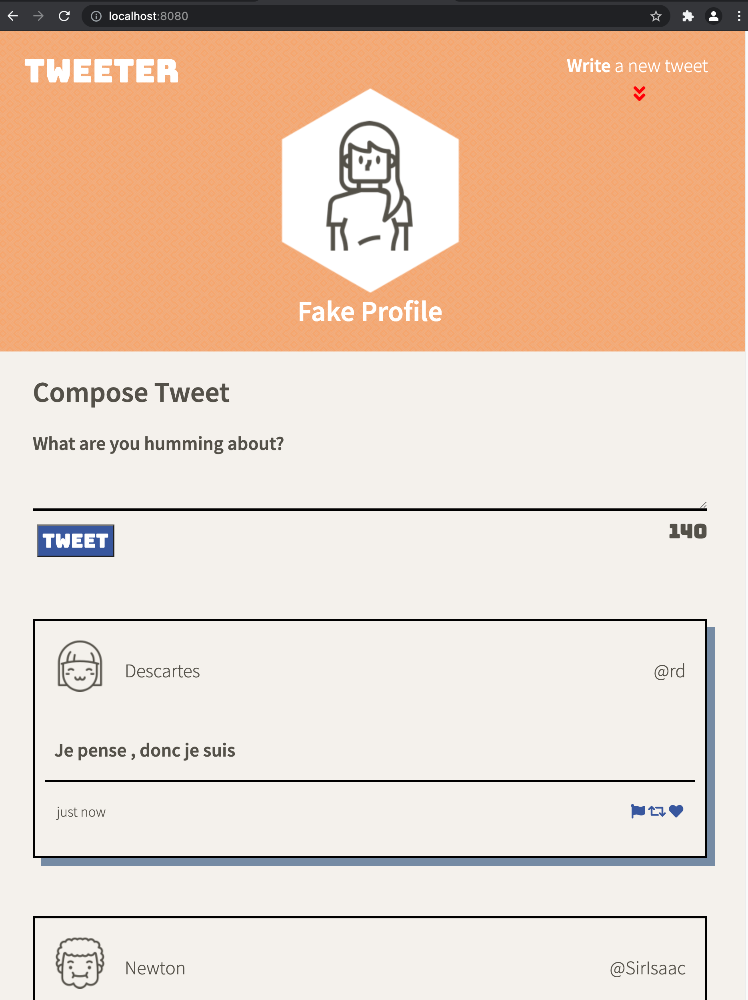
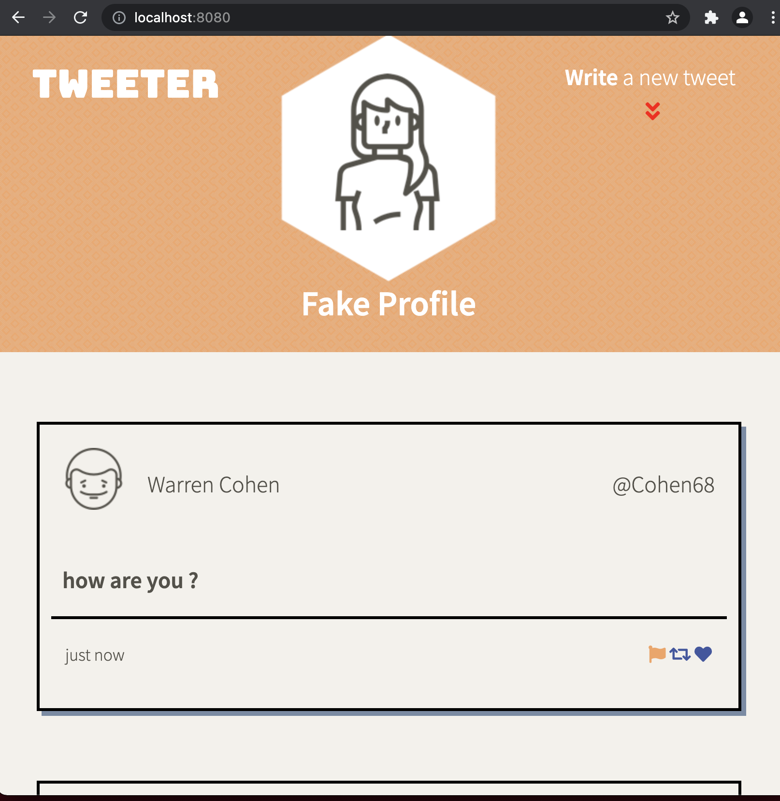
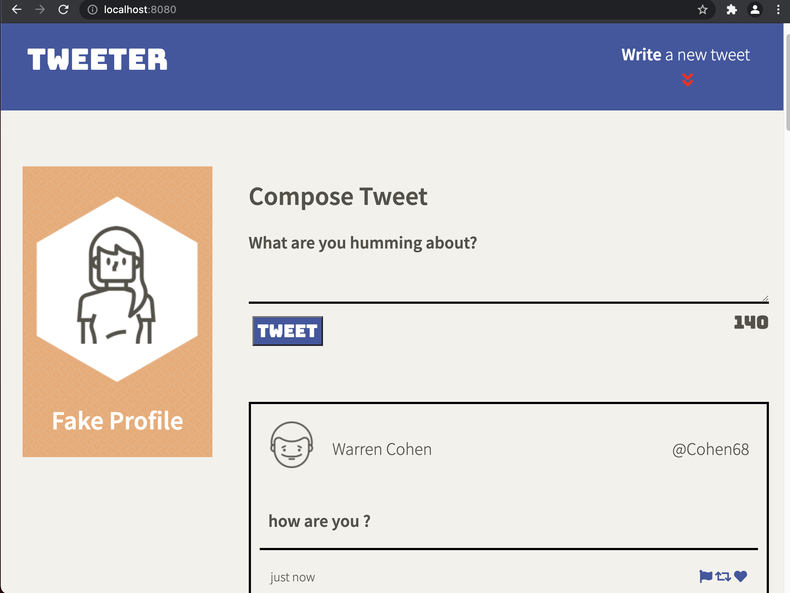
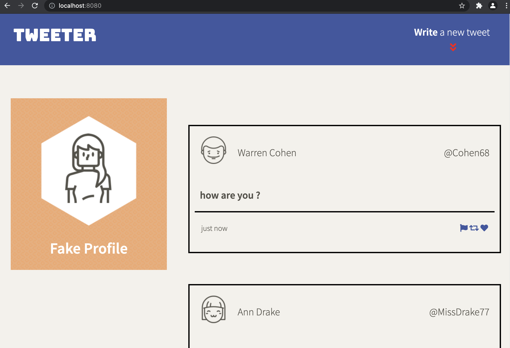

# Tweeter Project

Tweeter is a simple, single-page AJAX-based Twitter clone. This project is a part of week4 at Lighthouse Labs Web Development Bootcamp.
It uses jQuery, HTML5 and CSS3 with responsive design to adapt to screen sizes between desktop and tablet. 
Point to remember is this project is mainly to practice HTML, CSS, JS, jQuery and AJAX front-end skills.

## Final Product
###### Main Page (Tablet)

###### Main Page (Tablet - no input form)

###### Tablet - scrolled down: button to scroll up displayed at the bottom right corner

###### Display error

###### Box shadow: when user hovers over a tweet the box shows shadow effect

###### Flag color change - when user hovers over any of the three flags, they change color

###### Main Page (Desktop)

###### Main Page (Desktop - no input form)

## Dependencies

- Express
- Node 5.10.x or above
- Body Parser
- Chance
- md5

## Getting Started

1. Fork this repository, then clone your fork of this repository.
2. Install dependencies using the `npm install` command.
3. Start the web server using the `npm run local` command. The app will be served at <http://localhost:8080/>.
4. Go to <http://localhost:8080/> in your browser.

